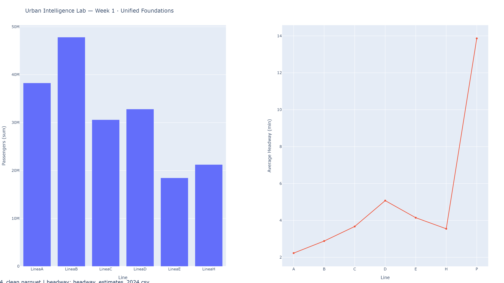
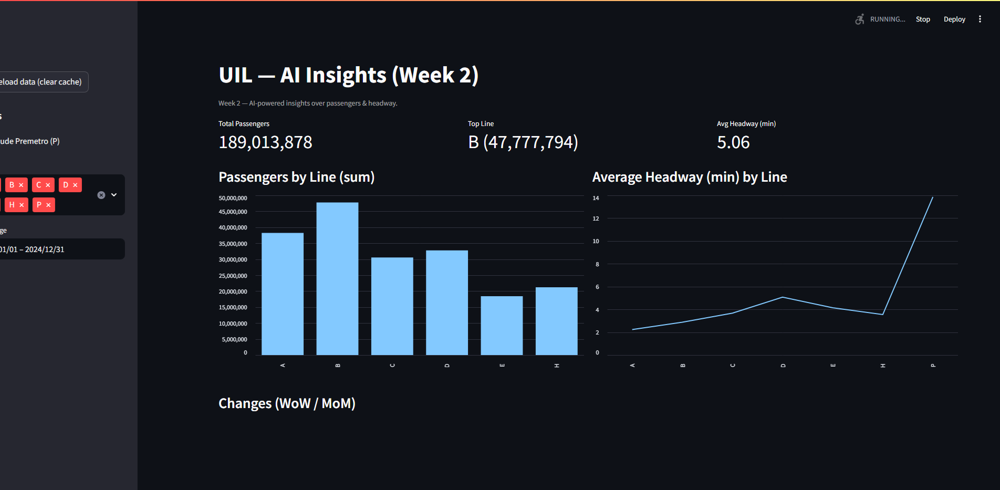
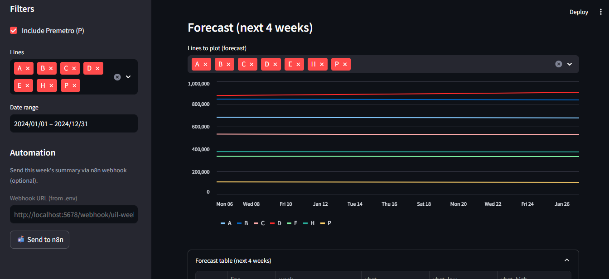
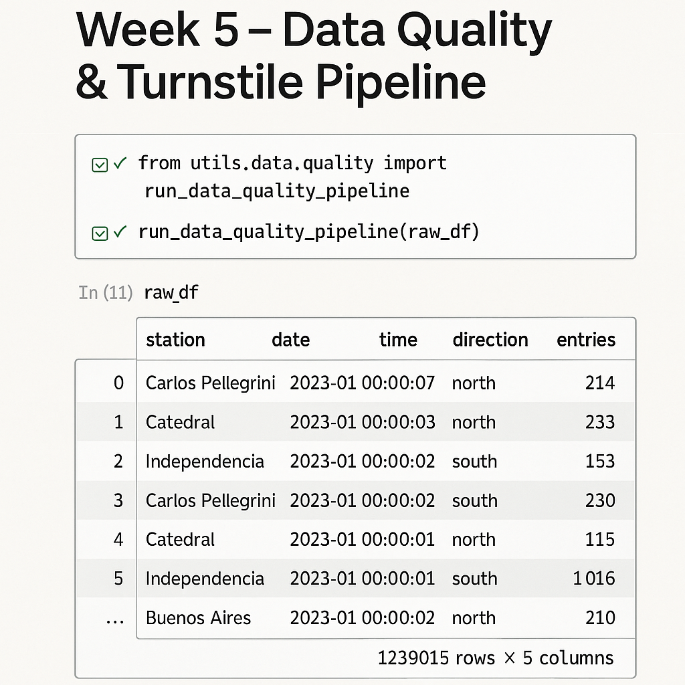
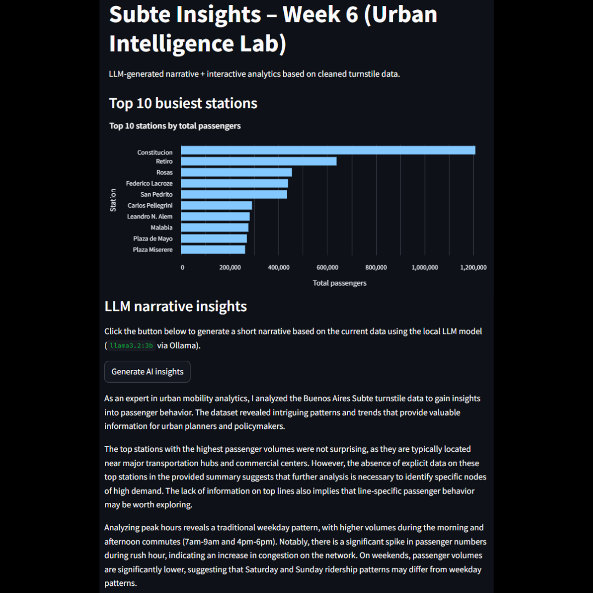
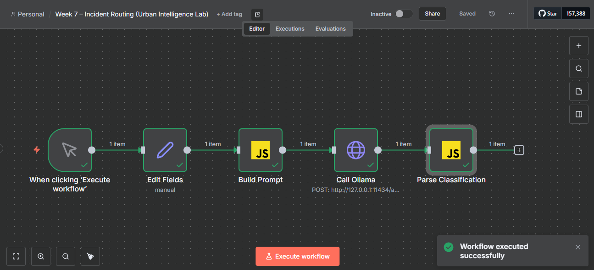
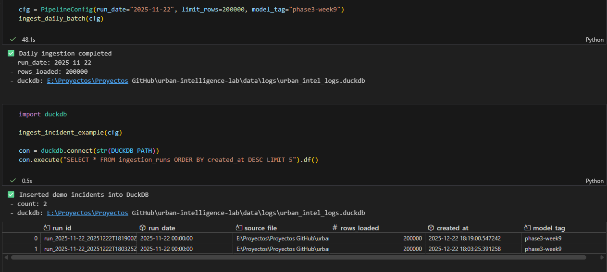

# Urban Intelligence Lab — Analytics, LLM Automation & Smart Workflows

**Urban Intelligence Lab** is an integrated environment that combines **public-transport analytics**,  
**LLM-powered insights**, and **automation workflows** to model, monitor, and understand urban mobility systems.

The project unifies datasets from Buenos Aires’ Subte system with local LLMs (via Ollama), Python-based  
pipelines, Streamlit dashboards, and n8n workflows—creating a modular platform that transforms raw data  
into forecasts, insights, classifications, and automated actions.

### 🔍 What the project delivers
- **Turnstile analytics** with cleaned, curated datasets  
- **LLM-generated narrative insights** and context-aware analysis  
- **Automated incident classification** (Python + n8n + Ollama)  
- **Unified master dashboard** combining analytics, insights, and workflow demos  
- **Modular architecture** designed for extensibility (Fase 3 & 4 planned)

### 🧱 Technologies
**Python (pandas, DuckDB, Streamlit), Ollama (local LLM), n8n (workflow automation), Prophet forecasting,  
data-quality pipelines, modular utilities.**

### 🎯 Purpose
The lab demonstrates the intersection of **data engineering**, **LLM engineering**, **automation**, and  
**product-oriented analytics**, making it a strong portfolio project with real-world applicability in  
transportation, operations, and intelligent systems.

---

## 📂 Repository Structure
urban-intelligence-lab/
├── app/
│ ├── main_dashboard.py # Dash BI
│ ├── insights_streamlit.py # Streamlit + AI
│ └── ui_hub.py # Unified portal
├── data/
│ ├── raw/
│ └── processed/ # Cleaned & forecast data
├── scripts/
│ ├── etl_headway_from_formaciones.py
│ ├── forecast_passengers.py
│ ├── generate_screenshot.py
│ └── capture_to_n8n.py
├── notebooks/
│ └── Week4_Data_Quality.ipynb
├── assets/
│ ├── screenshots/
│ └── reports/
├── requirements.txt
└── README.md

---

## 📊 Development Timeline (Weeks 1 – 4)

| Week | Focus | Main Deliverables |
|------|--------|------------------|
| **Week 1** | Unified foundations | Repo setup, base dashboards, data integration |
| **Week 2** | AI insights | Streamlit + Ollama integration for weekly reports |
| **Week 3** | Forecasts & automation | Prophet forecasts, n8n webhook connection |
| **Week 4** | Public release | Unified portal, data verification, v1.0.0 release |

---

## 🧭 Week Highlights

### Week 1 – Unified Foundations
✅ Merged Subte-Dashboard + AI-Automation projects  
✅ Re-integrated cleaned datasets (`molinetes_2024_clean.parquet`, `formaciones_2024.parquet`)  
✅ Dash dashboard with passenger trends and service data  

📸 *Screenshot:* 

---

### Week 2 – AI Insights
✅ Added **Ollama** integration for local AI summaries  
✅ Weekly reports auto-saved in `/assets/reports/`  
✅ Introduced data filters and KPIs  

📸 *Screenshot:* 

---

### Week 3 – Forecasting & Automation
✅ **4-week passenger forecasting** (Prophet pipeline)  
✅ **n8n automation** to send weekly summaries  
✅ Added **Premetro (P)** to analytics  

📸 *Screenshot:*

---

### Week 4 – Consolidation & Public Release
✅ Unified Portal (`ui_hub.py`) connecting Dash, Streamlit, and n8n  
✅ Repository reorganized for long-term scalability  
✅ Project structure aligned for the new Urban Intelligence Lab vision  
✅ First stable version **v1.0.0** released  

📸 *Screenshot:*  
  

---

### Week 5 – Data Quality & Turnstile Pipeline
✅ Consolidated **24 turnstile (`molinetes`) CSV files** into a unified dataset  
✅ Standardized column names + basic cleaning (duplicates, string trimming)  
✅ Applied the new **Data Quality Pipeline (`utils/data_quality.py`)**  
✅ Generated a clean dataset in `data/processed/` for Week 6 analytics  

📸 *Screenshot:*  

---

### Week 6 – LLM Insights & Narrative Dashboard
✅ Added **AI-generated insights** using a local LLM (Ollama `llama3.2:3b`)  
✅ Built **Subte Insights Dashboard** with real data + LLM narrative  
✅ Implemented automatic **station + passenger column detection**  
✅ Integrated **interactive analytics** (top stations, passenger volumes)  

📸 *Screenshot:*  

---

### Week 7 – LLM Incident Classification in n8n
✅ Added an **incident classifier module** (`llm/classifier.py`) using a local LLM (Ollama `llama3.2:3b`)  
✅ Built an **n8n workflow** to send free-text Subte incidents to the LLM and parse a structured classification  
✅ Standardized the JSON schema for `category`, `severity`, `line`, `station`, and `target_team`  
✅ Prepared the foundation for future automated routing and logging inside the Urban Intelligence Lab  

📸 *Screenshot:*  

---

### Week 8 – Unified Master Dashboard & Phase 2 Retrospective
✅ Created a **single Streamlit dashboard** integrating Subte analytics, LLM-based insights, and incident classification  
✅ Added an interactive demo for free-text incident routing aligned with n8n and Python modules  
✅ Consolidated all Phase 2 work into a public-ready portfolio structure  
✅ Published final retrospective and roadmap for next phase  

📸 *Screenshot:*  

---

### Week 9 – Daily Pipeline & Incident Logging
✅ Simulated daily ingestion pipeline from cleaned Subte turnstile data  
✅ Created a lightweight DuckDB logging layer for ingestion metadata  
✅ Inserted demo incident records to validate the incident timeline structure  

📸 *Screenshot:*  

---

📘 Retrospective – Phase 1 & Phase 2 (Weeks 1–8)

Phase 1 (Weeks 1–4) — Consolidated two separate projects into a unified urban analytics environment. Established a clean repository structure, integrated forecasting and automation modules, implemented initial data-quality validation, and published the first stable release (v1.0.0).

Phase 2 (Weeks 5–8) — Added a full data-quality pipeline for turnstile datasets, LLM-generated insights (via a local model), an automated incident-classification workflow (Python + n8n), and a unified Streamlit master dashboard. The project now combines analytics, automation, and LLM intelligence in a production-ready portfolio format.

---

## 🧪 Getting Started (Local)

git clone https://github.com/dochronos/urban-intelligence-lab.git
cd urban-intelligence-lab

# Virtual environment
python -m venv .venv
.venv\Scripts\activate  # Windows

# Install dependencies
pip install -r requirements.txt

# Run the unified portal
streamlit run app/ui_hub.py --server.port 8502

---

📜 License

Open for educational and portfolio purposes.
Data © Gobierno de la Ciudad de Buenos Aires — open-data license.