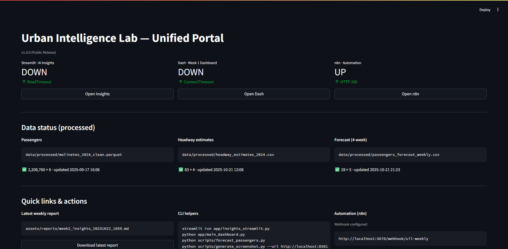

# 🧠 Urban Intelligence Lab (UIL) — Unified Analytics, Forecasting & Automation

**Goal:** Build a living urban data ecosystem that integrates **Business Intelligence, AI, and Automation**  
to explore, forecast, and optimize city systems — starting with the Buenos Aires Subway.

> This repository unifies two projects — *Subte-Dashboard* (BI) and *AI-Automation Workflow* (automation + LLMs) —  
> into a single professional environment combining data visualization, forecasting, and workflow orchestration.

---

## 🔍 Key Objectives
- Transform open transport data into **actionable urban insights**.
- Connect **AI-driven automation** with real-time BI dashboards.
- Forecast future demand and service patterns.
- Maintain a **fully local**, transparent, and modular setup using **Ollama + n8n**.

---

## 🧩 Modules Overview
| Module | Technology | Purpose |
|---------|-------------|----------|
| **Dash Dashboard** | Dash + Plotly | Data visualization and BI (Week 1) |
| **Streamlit AI Insights** | Streamlit + Ollama | AI summaries and forecasting (Weeks 2 & 3) |
| **n8n Automation** | n8n | Webhook-based workflow automation |
| **Unified Portal** | Streamlit | Single entry point (Week 4) |
| **ETL Scripts** | Pandas + Prophet | Data processing, headway estimation, and forecasts |

---

## 🛠️ Tech Stack
- **Python 3.12**, **Pandas**, **Plotly Dash**, **Streamlit**
- **n8n** (automation), **Ollama LLMs** (local AI)
- **DuckDB / SQLite** for lightweight persistence
- **Prophet** for time-series forecasting
- **Kaleido** for chart exports
- **dotenv + requests** for environment and integration management

---

## 📂 Repository Structure
urban-intelligence-lab/
├── app/
│ ├── main_dashboard.py # Dash BI
│ ├── insights_streamlit.py # Streamlit + AI
│ └── ui_hub.py # Unified portal
├── data/
│ ├── raw/
│ └── processed/ # Cleaned & forecast data
├── scripts/
│ ├── etl_headway_from_formaciones.py
│ ├── forecast_passengers.py
│ ├── generate_screenshot.py
│ └── capture_to_n8n.py
├── notebooks/
│ └── Week4_Data_Quality.ipynb
├── assets/
│ ├── screenshots/
│ └── reports/
├── requirements.txt
└── README.md

---

## 📊 Development Timeline (Weeks 1 – 4)

| Week | Focus | Main Deliverables |
|------|--------|------------------|
| **Week 1** | Unified foundations | Repo setup, base dashboards, data integration |
| **Week 2** | AI insights | Streamlit + Ollama integration for weekly reports |
| **Week 3** | Forecasts & automation | Prophet forecasts, n8n webhook connection |
| **Week 4** | Public release | Unified portal, data verification, v1.0.0 release |

---

## 🧭 Week Highlights

### Week 1 – Unified Foundations
✅ Merged Subte-Dashboard + AI-Automation projects  
✅ Re-integrated cleaned datasets (`molinetes_2024_clean.parquet`, `formaciones_2024.parquet`)  
✅ Dash dashboard with passenger trends and service data  

📸 *Screenshot:* `assets/screenshots/week1_dashboard.png`

---

### Week 2 – AI Insights
✅ Added **Ollama** integration for local AI summaries  
✅ Weekly reports auto-saved in `/assets/reports/`  
✅ Introduced data filters and KPIs  

📸 *Screenshot:* `assets/screenshots/week2_ai_insights.png`

---

### Week 3 – Forecasting & Automation
✅ **4-week passenger forecasting** (Prophet pipeline)  
✅ **n8n automation** to send weekly summaries  
✅ Added **Premetro (P)** to analytics  

📸 *Screenshot:* `assets/screenshots/week3_forecast.png`

---

### Week 4 – Consolidation & Public Release
✅ **Unified Portal (`ui_hub.py`)** connecting Dash, Streamlit, n8n  
✅ Data quality validation (`Week4_Data_Quality.ipynb`)  
✅ Repository structured and documented for public portfolio  
✅ First stable version **v1.0.0** released  

📸 *Screenshot:*  
  

---

## 🧪 Getting Started (Local)

git clone https://github.com/dochronos/urban-intelligence-lab.git
cd urban-intelligence-lab

# Virtual environment
python -m venv .venv
.venv\Scripts\activate  # Windows

# Install dependencies
pip install -r requirements.txt

# Run the unified portal
streamlit run app/ui_hub.py --server.port 8502

---

🔗 LinkedIn Posts (Build in Public)

| Week | Title                          | Date        |
| ---- | ------------------------------ | ----------- |
| 1    | Unified Foundations            | Oct 27 2025 |
| 2    | AI Insights                    | Nov 3 2025  |
| 3    | Forecasting & Automation       | Nov 10 2025 |
| 4    | Public Release & Consolidation | Nov 17 2025 |

---

🧩 Evolution — Phase 2 (Dec 2025 → Feb 2026)

REST API endpoints (FastAPI) for data queries

Predictive dashboards and alerting system

City-wide mobility datasets (GTFS, weather, events)

Publication of an Urban Data Hub demo site

---

📜 License

Open for educational and portfolio purposes.
Data © Gobierno de la Ciudad de Buenos Aires — open-data license.